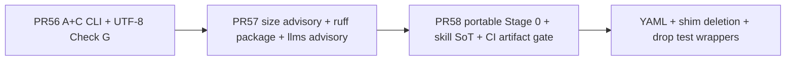

# Status

Current-state snapshot of `spring-boot-doc-agent`, edited in place — this file states what's true *right now*, not a history of how it got there. For the append-only history of individual commits and which `claude/steering-prompts/` assumptions they affect, see `claude/session-log.md`. The two are cross-linked, not duplicates: this file answers "where do things stand"; the log answers "what changed and when."

Last updated: 2026-07-30.

> **Date convention:** dates in this repo are the local date of the commit (`git log --date=short`). A batch of entries written across 2026-07-23/24 were dated `2026-07-25`, one day ahead of every commit they describe. Historical entries in `claude/session-log.md` and `claude/tool-quirks.md` are left as written — silently rewriting dates in an append-only log is worse than an off-by-one — but new entries should use the commit's own date.

## Done, confirmed delivered

- **`skills/semantic-pipeline-eval/` and `skills/capacity-preflight/`, plus `MATURITY_ASSESSMENT.md`** — a semantic/LLM-judge evaluation layer for the four LLM pipeline stages (extending `claude/steering-prompts/01-testability-research-prompt.md`'s originally-deferred scope beyond `test_pipeline_stages.py`'s mechanical-only checks), a pre-run capacity/cost estimator that turns `CONSTRAINTS.md`'s scale assumptions into per-repo numbers (`src/doc_engine/tools/capacity_preflight.py`, importing rather than re-deriving `partition_repo.py`'s/`spring_signal_scan.py`'s/`build_cross_group_edges.py`'s own logic), and a root-level maturity scorecard with an adoption gate checklist. Tests: run `pytest tests/test_semantic_eval_helpers.py` and `pytest tests/test_capacity_preflight.py`; both are wired into `.github/workflows/ci.yml`. (Counts deliberately not quoted here — see `CLAUDE.md`'s "Don't hardcode a test count"; the two that used to be are what prompted that rule.) (This said 12/12 from the suite's first draft and was never corrected; `claude/session-log.md` had 19/19 right from the entry that created it.) Found and fixed one real, stale-documentation gap during this work: `.claude-plugin/plugin.json`'s license is actually `MIT`, not the `UNLICENSED` this file and `CONSTRAINTS.md` both still said — corrected in the same change.
- **Cross-group edge resolution moved into Stage 0** (`src/doc_engine/tools/build_cross_group_edges.py`, PR #44 / `abd3ade`) — Stage 1 used to receive the entire repo-wide `references` bucket and be asked to string-match its own cross-group relationships out of it, once per group. That is a `package`/`import` join executed by a language model with the whole right-hand table in context, at `g x |R|` volume. It is now a hash join computed once, deterministically, with each group receiving only the arcs on its own boundary — measured at 27x fewer rows shipped on a real 615-file service. The subagent receives resolved arcs as ground truth carrying `file:line` provenance (so they are legitimately `[Evidenced]`-taggable) rather than inferring them. Three correctness properties are pinned by tests because each is easy to get wrong: the grouping is a *cover* not a partition (a file can be in two groups, so `owner(u) != owner(v)` is ill-defined); imports must resolve to a type, not a package, or the join fans out to every file in the package; and same-package is an equivalence relation, so packages are emitted as adjacency rather than materialized cliques. **`src/doc_engine/tools/capacity_preflight.py` was not updated when this landed** and kept measuring the removed broadcast until 2026-07-24 — see `CONSTRAINTS.md`'s "Two new, related tools" note.
- **This repo's first CI workflow** (`.github/workflows/ci.yml`) — runs on every `pull_request`/`push` to `main`: `pytest tests/` (covering every `tests/test_*.py` suite except the opt-in `test_partition_repo_real_world.py`), plus `ruff check`, `scripts/check_code_quality.py` (both blocking, added 2026-07-24) and `check_llms_coverage.py` (`verify_llms_docs.py` was removed — see the next bullet), against a full-history checkout with dependencies installed via `pip install -r requirements.txt` and `requirements-dev.txt` (avoids a slow `cargo install` build). Resolves `claude/steering-prompts/07-ci-scaffold-task-prompt.md` and `CONSTRAINTS.md`'s "Integration gaps" item 2. Branch protection requiring this check to pass is a deliberately separate, not-yet-taken next step — see `CONSTRAINTS.md`'s "Enterprise-readiness gaps" item 6 for the exact `gh api` command.
- **Code-quality ratchet** (`claude/steering-prompts/13-code-quality-research-prompt.md`, phase 1) — `ruff` (pinned in a new `requirements-dev.txt`, kept out of `requirements.txt` so the runtime prerequisite set stays exactly three) took `scripts/` from 617 lint findings to zero; `scripts/check_code_quality.py` records per-function statement count, cyclomatic complexity and nesting depth plus production-module type-annotation coverage into a committed `scripts/code_quality_baseline.json` and fails CI on *regression only* — it never asks for a refactor. Both steps are CI-wired and blocking. `ruff format` is deliberately NOT wired: 29 of 33 files would be reformatted, which belongs in its own commit with a `.git-blame-ignore-revs` entry rather than burying every later diff. Two deferred ruff rule families carry their counts in `.ruff.toml` rather than being silently ignored. The measurement pass that built this also found two live defects, fixed in the same PR — see `CONSTRAINTS.md` "Runtime prerequisites" item 1 (corrected from `[Resolved]` to `[Partially resolved]`, then genuinely closed) and the `capacity_preflight.py` path-separator bug, which was the third occurrence of one already fixed twice elsewhere and is now closed as a class via `partition_repo.to_posix()`/`relpath_posix()`.
- **~~`scripts/verify_llms_docs.py` + `	ests/test_verify_llms_docs.py`~~ — deleted 2026-07-25 as a security defect.** It re-ran every documented `git`/`gh` command from `claude/llms/pr-*.md` on each CI run, by extracting backtick-fenced spans from LLM-authored markdown and passing them to `bash -c` with `GH_TOKEN` in scope. Prefix matching made any `;` in a span arbitrary code execution (reproduced). Removed per `claude/10-architecture-maturation-plan.md` scrap item 2 and 0.1.3 — "closed by omission … do not re-add it." It did find one real drift while it existed (`pr-8.md` said PR #8 was open after it merged at `a0acc76`). `claude/llms/pr-*.md` survives as a human-read convention; `check_llms_coverage.py` still runs and executes nothing from markdown. `CONSTRAINTS.md`'s "Integration gaps" item 4 is reopened accordingly.
- **Secret/credential-redaction heuristic** (`src/doc_engine/scanning/support/_secret_heuristics.py`) — `python -m doc_engine.tools.spring_signal_scan` now flags `redaction_zones` (file/line/heuristic, never the value) for configuration/deployment files; `adapters/claude/agents/file-summarizer.md`, `adapters/claude/agents/doc-writer.md`, and `doc-taxonomy.md`'s configuration.md notes now all say not to transcribe a flagged line's value. `src/doc_engine/tools/check_no_secrets_leaked.py` re-applies the same heuristics to a completed run's own output as a deterministic defense-in-depth check (documented in `SKILL.md` as an optional post-run step). Resolves `CONSTRAINTS.md`'s "Secret/credential leakage" gap, heuristically — stated residual scope, not a guarantee (see that file's entry). Complementary signal for repos where config files are checked-in placeholders rather than real secrets: the scan also records each config file's dotted key *set* (`config_key_sets`, `src/doc_engine/scanning/support/_config_keys.py`, no YAML dependency), and `python -m doc_engine.tools.spring_drift_check` now distinguishes a structural key change (`config_structure_changed`, expected) from the same keys holding different values (`config_values_only_changed_review_needed`, worth a look).
- **Six-item implementation handoff** (`IMPLEMENTATION_HANDOFF.md`) — all six items landed: orphaned `doc-taxonomy.md` copy removed, shared exclude-dir module, opt-in `--respect-gitignore`, doc-writer/doc-taxonomy tag-rule dedup, `build_groups()` strict-mode swap, repo-wide import/package reference index closing the file-summarizer group-boundary seam. Confirmed via git history (PR #1) and passing test suites, not by trusting the handoff doc's own claims.
- **`CONSTRAINTS.md`** — added at plugin root, covering runtime prerequisites, integration gaps, precision tradeoffs, confidentiality rules, and enterprise-readiness gaps. Cross-linked from `README.md` and `SKILL.md`. Resolves `claude/steering-prompts/03-constraints-research-prompt.md`.
- **`spring_drift_check.py` wired into docs** — documented as an optional Stage 0 pre-flight check in `SKILL.md`, and in `README.md`'s "On drift detection" section. Still standalone (not CI-triggered), which both files say explicitly. Resolves `claude/steering-prompts/06-wiredrift-check-task-prompt.md` and the re-scoped item 1 of `04-analytics-logging-research-prompt.md`.
- **Write-then-verify rule + this status doc** — `CONTRIBUTING.md` now states the write-then-verify rule explicitly (see that file for the two incidents that motivated it and the research behind it); this file is the "single current-state doc" half of `claude/steering-prompts/05-clarity-delivery-trust-research-prompt.md`'s ask.
- **Dependency pinning** (`claude/steering-prompts/08-dependency-pinning-task-prompt.md`) — `requirements.txt` added at plugin root (`ast-grep-cli~=0.45.0`, `sqllineage~=1.5.8`, `pathspec~=1.1.1`); `.github/workflows/ci.yml` installs from it. Resolves `CONSTRAINTS.md`'s "Runtime prerequisites" item 4.
- **Run-manifest / audit-trail telemetry** (`claude/steering-prompts/04-analytics-logging-research-prompt.md` item 2) — `src/doc_engine/tools/run_manifest.py` records per-stage timing/pass-fail/canceled state, `file_signatures`, evidence-tag counts, and interview answered/skipped breakdown to `run_manifest.json`; tested via `tests/test_run_manifest.py`, CI-wired through `pytest tests/`. `spring_drift_check.py` gained an optional `--manifest run_manifest.json` baseline flag (2026-07-25) so its `file_signatures` can feed drift checks directly. Stated residual gap: if the orchestrating session dies before `finalize` runs, the manifest sits at `status: "running"` forever — no background recovery.
- **Pipeline inter-stage contracts + orchestrator (B then A)** (`claude/steering-prompts/02-pluggability-research-prompt.md`) — Pydantic boundary models (`src/doc_engine/pipeline/artifacts.py`), JSON Schema exports (`scripts/schemas/`), `src/doc_engine/tools/validate_artifacts.py`, shipped mechanical validators (`src/doc_engine/tools/pipeline_validators.py`), SKILL.md "Data contracts between stages" + pre–Stage 4 gate; executable stage graph in `src/doc_engine/pipeline/` (`PipelineRunner`, `StageExecutor` port, `MockStageExecutor`); `python -m doc_engine.pipeline.local_runner` drives the same graph with mocked generative stages. Tests: `tests/test_artifact_schemas.py`, `tests/test_pipeline_runner.py`; CI validates the committed `spring_signals` fixture against the schema after pytest. Residual: CI does not schema-gate artifacts from a full live pipeline run (no target-repo run in CI).
- **`claude/llms/` coverage backfill + enforcement** — `scripts/check_llms_coverage.py` (CI-wired) flags merged PRs with no corresponding `pr-N.md` or a stale `state:` field; six missing docs backfilled, one stale one fixed. Its "most-recently-merged PR is exempt" heuristic hit a real fast-merge-burst failure mode the same day it shipped, so `ENFORCE` is currently `False` (findings still print, don't fail the build) until the heuristic gets the refinement flagged in `CONSTRAINTS.md`.

## Pending

- **`claude/steering-prompts/01-testability-research-prompt.md`** — partially resolved, not fully closed. `tests/test_pipeline_stages.py` covers mechanical/structural checks (CI-wired via `pytest tests/`) and `skills/semantic-pipeline-eval/` scaffolds the qualitative LLM-as-judge layer this prompt originally deferred — but that semantic layer is manually invoked, not CI-integrated, so the prompt's full original scope (mechanical + judgment, both automated) still isn't entirely closed.
- **`claude/steering-prompts/05-clarity-delivery-trust-research-prompt.md`** — items 1 and 2 covered by `CONTRIBUTING.md` and this file. Item 3's "genuinely useful small write-verification helper" was researched and found not to exist as an on-point, well-maintained GitHub project — codified as a checklist rule instead, per the prompt's own fallback instruction. A `PostToolUse` hook automating the re-read step is documented as a viable mechanism in `CONTRIBUTING.md` but not implemented; picking that up is the concrete next action for this prompt if automation (not just a documented checklist step) is wanted.
- **`claude/steering-prompts/09-tool-quirks-indexing-research-prompt.md`** — not started. `claude/tool-quirks.md` (added 2026-07-24) is currently a flat, append-only file with no tags/index beyond full-text search; this prompt scopes how to categorize and index it for efficient routing/retrieval before it grows past what a linear read can handle.
- **`scripts/check_llms_coverage.py`'s exemption heuristic** — "exempt exactly the single most-recently-merged PR" is a real fix for the infinite-regress bug but a blunt one; the repo owner flagged it (2026-07-25) as needing refinement, not yet specified further. `ENFORCE = False` until either the heuristic is sharpened or merge cadence settles.
- **Enterprise-readiness gaps** (`CONSTRAINTS.md`'s own list, highest-priority first): license resolved (`MIT`); confidentiality/secret-redaction resolved (heuristic); CI wiring resolved; dependency pinning resolved (2026-07-25) — remaining open items are branch protection + required reviews on `main` (repo-admin action, `gh api` command specified in `CONSTRAINTS.md` item 6, deliberately not yet taken), no audit trail beyond `run_manifest.py`'s own stated residual gaps, and no RBAC or multi-repo support (lowest priority, furthest from what a single-operator tool needs first).

## Next concrete action

Packaging / A+C / portable-kernel arc is **paused** on `main` (through PR #58 / suite-layout follow-ons). Do not open another packaging mega-PR.

**Research gate closed (2026-07-30):** Pre–Phase 1 spike → [`claude/research/fact-store-phase1-decision-memo-2026-07-30.md`](claude/research/fact-store-phase1-decision-memo-2026-07-30.md) (**REFINE**). Corpus + collation sit beside it. **Do not treat** [`claude/10-architecture-maturation-plan.md`](claude/10-architecture-maturation-plan.md) §0–1 or the JPA survey as current executable specs — outdated relative to portable kernel / packaging pause / contested map / scanner defaults; thesis only, revalidated externally.

**Chosen next engineering investment (do not mix; start only when explicitly asked):** thin **dual-emit fact ledger** per the memo (§3), not a full walk of the maturation plan or JPA catalog. Parallel, non-code: repo-admin **branch protection + required CI** on `main` (`CONSTRAINTS.md` enterprise item 6).

**Sequencing lock (do not fold):** Schema/SPI scoping (`claude/deterministic-boundary-schemas-spi-research-2026-07-29.md`) — implement only after / with fact-store Phase 1, not as a packaging sidecar.

Later / not now: redesign or delete llms coverage step; Option C `HttpLLMStageExecutor` (named customer only); entry-point SPI / deepen untyped `dict` boundaries outside existing artifact validators (research before code).

**Product invoke surface (one SoT):** `python -m doc_engine.tools.<mod>` and `doc-engine` for orchestration. Thin product aliases under scripts/ are gone. Test SoT is `tests/` via `pyproject.toml` `testpaths` (gates read that contract — do not re-encode the root in `ci.yml` string sniffs). Meta CI tools stay under `scripts/`. Do not re-add dual homes.

**Hygiene:** CI parses every `.github/workflows/*.yml` via `scripts/check_workflow_yaml.py`. Accidental `.vs/` and stale `baseline-reference/` removed from git. Local target checkouts / `local-runs/` / preview dirs stay untracked (wipe anytime).

### Recent arc (what we built)

- Invoke surface: skills/Action → `doc-engine` only (no plugin `scripts/`)
- Portable kernel: Stage 0 + product gates without monorepo tree
- Product tools: single SoT under `doc_engine.tools` (`python -m`); meta CI stays in `scripts/`
- Tests: `pytest tests/` only (no scripts/ test forwarders)
- Contracts: Pydantic artifacts, compliance profiles, `certification.json`
- Gates: hard = annotations/docstrings/claims/UTF-8/ast-grep; size advisory; llms advisory
- Dual skill trees: adapter SoT + root mirror with CI equality

## Cross-links

- `claude/session-log.md` — append-only commit history for steering-prompt-affecting changes.
- `CONTRIBUTING.md` — write-then-verify rule and the research behind it.
- `CONSTRAINTS.md` — the plugin's standing constraints, a different axis from this file's done/pending tracking.
- `IMPLEMENTATION_HANDOFF.md` — the six-item handoff this file's "Done" section summarizes.
- `MATURITY_ASSESSMENT.md` — overall maturity scorecard, drift-from-modern-practice analysis, and adoption gate checklist; builds on `CONSTRAINTS.md`'s itemized facts rather than duplicating them.

