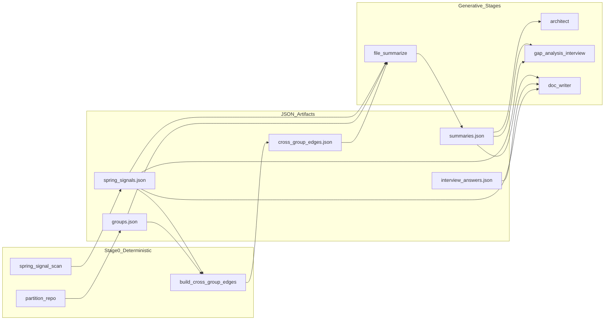

# Pipeline bounded contexts and artifact flow

Context map for org customers: which stage owns which artifact and what each handoff validates.



## Bounded contexts

| Context | Responsibility | System of record |
|---------|----------------|------------------|
| Evidence scan | ast-grep/CodeQL signals, entity-table map, file signatures | `spring_signals.json` |
| Partitioning | token-bounded DFS groups | `groups.json` |
| Cross-group join | deterministic package/import edges | `cross_group_edges.json` |
| Summarization | per-file semantic summaries + line anchors | `summaries.json` |
| Architecture | Mermaid diagram fragments + merge | `architecture_merged.md` |
| Interview | human facts static analysis cannot see | `interview_answers.json` |
| Doc emission | fourteen taxonomy markdown files | `docs/*.md` |

## Validation at boundaries

After each artifact-producing stage, run:

```bash
python3 scripts/validate_artifacts.py --all <run-directory>
```

Mechanical shape gates (summaries, gap questions) live in `doc_engine.tools.pipeline_validators` (`scripts/pipeline_validators.py` shim).

Schemas: `scripts/schemas/*.schema.json` (derived from `doc_engine.pipeline.artifacts`).

## Code entry points

- `PipelineRunner` — `src/doc_engine/pipeline/runner.py`
- `PipelineContext` — paths, repo, manifest, in-run state
- `MockStageExecutor` — local E2E without LLM
- `local_runner.py` — full local pipeline orchestration; `scripts/run_pipeline_local.py` is a thin shim

SKILL.md stage names map 1:1 to `build_stage_specs()` in `stages.py`.
